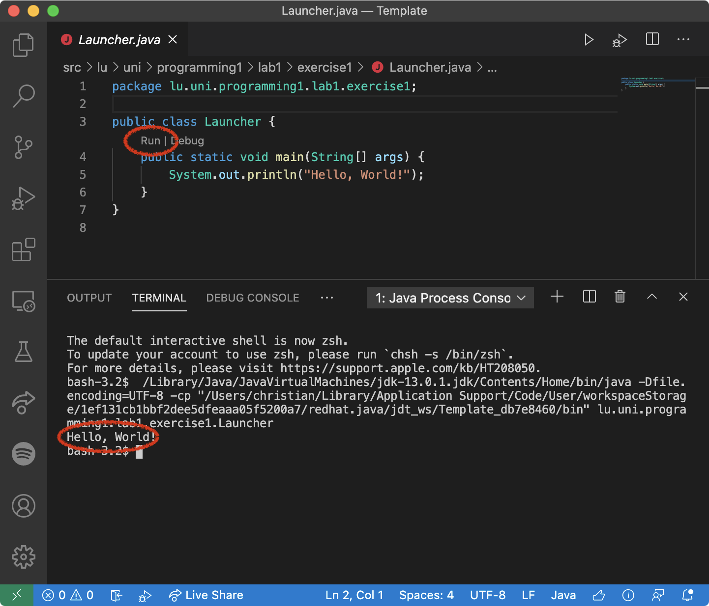
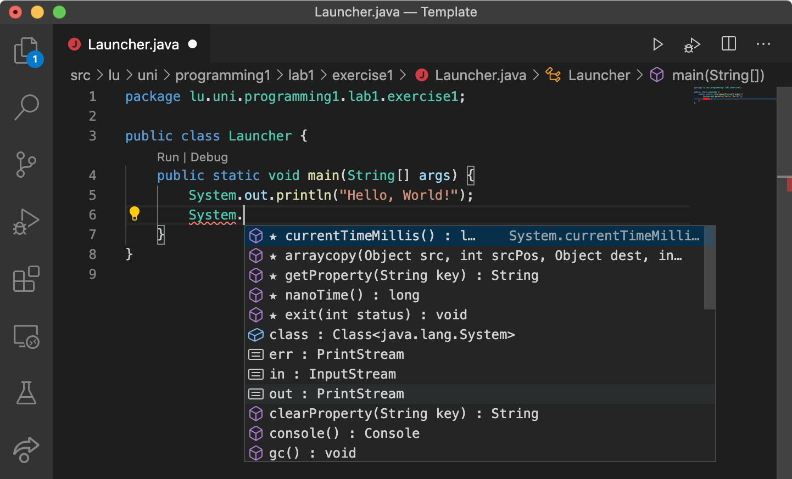
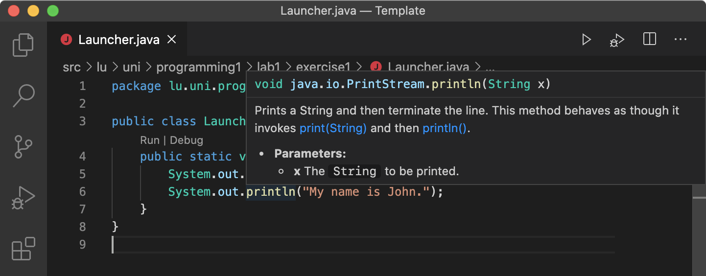
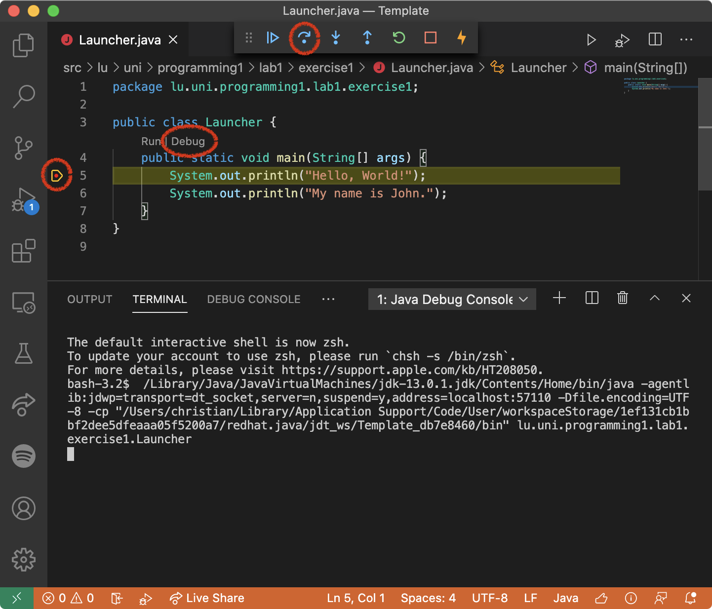
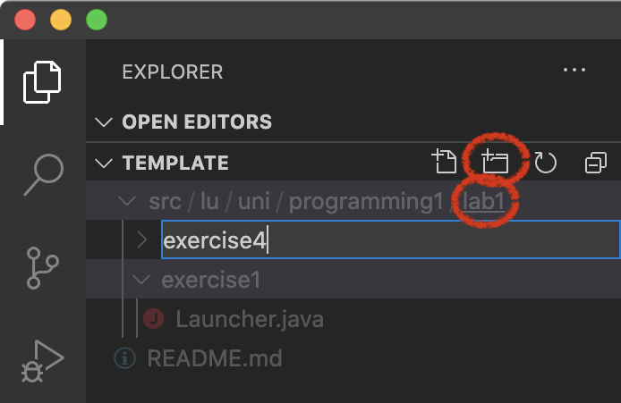
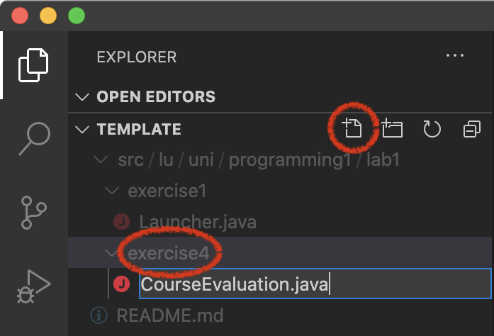
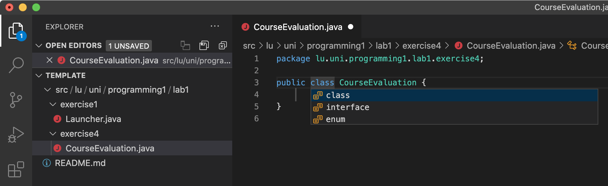
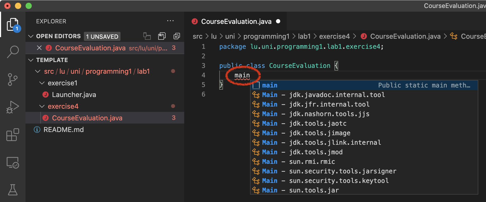

# Programming 1 - Lab 1: "Hello, World!", Variables & Basic Sequence of Instructions

#### TA Contact:
- [Patrick Keller](mailto:patrick.keller@uni.lu)

#### Submission

The mandatory exercises for **Code Submission** are:
- Exercise 4 (Course Evaluation)
- Exercise 6 (How's the weather?)
- Exercise 7 (Swapping the Contents of 2 Variables)
- Exercise 9 (Prefix & Postfix Operators)

All other exercises on this sheet are optional but still highly recommended!

The **Explainer Video** for this sheet must be realized on Exercise 4 (Course Evaluation). A Flipgrid invitation link will be posted on Moodle.

#### Deadlines
- Preliminary Submission: 03/10
- Final Submission: 10/10

Follow the steps described in [this video](https://moodle.uni.lu/mod/book/view.php?id=158136&chapterid=3636) to clone the template repository. If you are seeing this file inside VS Code, you have probably done this already. You can read this Markdown file either in its raw version, or rendered on GitHub.

## Exercise 1: Hello, World!

[#println](https://alma.uni.lu/api/learningmaterial/?uris=%5B%22java:println%22%5D&app=MD&context=Programming_1_Lab_1&selection=Exercise_1)

> :bulb: **Hashtags:** If you have an issue in understanding the aspect of an exercise and want to know more about it, you can retrieve related learning material (if available) by clicking on a hashtag like the own here above.

In this exercise, you will have some first hands-on experience with VS Code. The *Hello, World!* example is a typical entry point when learning a new programming language.

After opening this project by either freshly cloning it or opening an existing folder on your computer (`File -> Open...`), you can see on the left-hand side the *Explorer* view showing the contained subfolders and files, including this very `README.md` file. Source code always goes into the `src` folder. Inside of it, there are a couple of subfolders, which are necessary to respect Java's *package* hierarchy.

1. Click on the `Launcher.java` file within `src/lu/uni/programming1/lab1/exercise1/` to open it. You can see that it has been pre-populated with a *class* `Launcher`, belonging to the package `lu.uni.programming1.lab1.exercise1` (hence the folder hierarchy), and the `main` *method*. The `main` method is the entry point of a Java program. More on packages and the `main`-method in the lecture. It contains the statement

```java
System.out.println("Hello, World!");
```

This statement will print the line *Hello, World!* to the console. Note that statements in Java are terminated by a semicolon (`;`).

2. Click on `Run` (just above the `main` method) and watch how the console opens up with *Hello, World!* printed on it. This action compiles the Java source code into Java bytecode, which will get interpreted by the *Java Virtual Machine (JVM)*. More on this also during the lecture.

	

3. Now add the line

```java
// Just a comment
```

below the `System.out.println` statement. Run the program again. You will see that the output is untouched, in particular *Just a comment* is not shown anywhere. This is due to the fact that this line is a *comment*, i.e., a statement not taken into account by the compiler. Comments are used to make a piece of code more readable to the human eye, by giving explanations on the code.

## Exercise 2: Autocompletion & Documentation

1. In the same file, add another `System.out.println` statement, but this time, only write `System.` and wait for a context menu to open. It will suggest *attributes* and *methods* in the `System` class. The list can be navigated with the arrow keys and an element can be selected by pressing Enter/Return. This autocompletion feature may increase your coding efficiency, in opposition to typing everything. In addition, it gives you insights to the internal structure of a class.

	

2. Add yet another `System.out.println` statement, but this time, only write `sysout` and press Enter/Return, which will expand this shortcut to the full statement.
3. With the cursor, hover over `System`, `out` or `println`. You will see a tooltip with related *Javadoc* comments. In this case, they were defined in the [Java SE API](https://docs.oracle.com/en/java/javase/16/docs/api/index.html).
   
	

## Exercise 3: Debugging

1. Click in the margin of the line with the first `System.out.println` statement. A red bullet will appear, symbolizing a *breakpoint*, i.e., a point in your program where the process will stop and from whereon you can step through the code line by line.
2. This time, click on `Debug` (above the `main` method) to run the program in the *Debug* mode. The program will enter, as usual, through the `main`-method and will stop before the breakpoint.
3. Click on the *Step Over* icon (or press `F10`) to execute the statement. Do this several times to execute the program line by line. Observe both the highlighted statement in the Editor view and the output on the Console view. Once the last statement in the `main`-method has been executed, the program will terminate.



> ## :pencil2: **Creating a new package, class and main method**
>
> For the upcoming exercises, you will create a separate package per exercise. To do so, click on `lab1` in the explorer and then on the *New Folder* icon. Name the new folder `exercise4`. This way, a new package `lu.uni.programming1.lab1.exercise4` is created.
>
> 
>
> With the newly created folder selected, click on the *New File* icon and name it `CourseEvaluation.java` (that's the class to be written in Exercise 4 below).
>
> 
>
> The new file will open and suggest you to create either a class, an interface or an enum. Stick with the class and hit enter.
>
> 
>
> Finally, add the `main` method stub by just writing `main` and, upon the autocompletion suggestion, hitting enter. You should now have a new Java class with an (empty) `main` method.
>
> 


> ## :pencil2: **Reading User Input**
>
> The `Scanner` class can parse primitive types and character strings from input streams. Among others, standard input (i.e., keyboard input from the terminal, in VS Code, the *Terminal* view) can be captured. From the [Java 16 documentation](https://docs.oracle.com/en/java/javase/16/docs/api/java.base/java/util/Scanner.html), we can read:
>
> > *A Scanner breaks its input into tokens using a delimiter pattern, which by default matches whitespace. The resulting tokens may then be converted into values of different types using the various next methods.*
>
> Consider the following program. Note that all code is within the `main` method.
>
```java
package lu.uni.scanner;

import java.util.Scanner;

public class AgeInput {

	public static void main(String[] args) {
		// Initialization of a Scanner object
		Scanner scanner = new Scanner(System.in);
		
		System.out.print("Please enter your age: ");
		
		// Reading a number from standard input
		int age = scanner.nextInt();
		
		System.out.println("You are " + age + " years old.");

		// Streams should be closed
		scanner.close();
	}

}
```
>
> There exists a method for each specific primitive type (and strings), among others `next()`, `nextLine()`, `nextBoolean()`, `nextInt()`, `nextFloat()`, `nextDouble()`.

## :exclamation: :movie_camera: Exercise 4: Course Evaluation

[#VariableDeclaration](https://alma.uni.lu/api/learningmaterial/?uris=%5B%22java:VariableDeclaration%22%5D&app=MD&context=Programming_1_Lab_1&selection=Exercise_4) [#VariableInitialization](https://alma.uni.lu/api/learningmaterial/?uris=%5B%22java:VariableInitialization%22%5D&app=MD&context=Programming_1_Lab_1&selection=Exercise_4) [#AssignmentOperator](https://alma.uni.lu/api/learningmaterial/?uris=%5B%22java:AssignmentOperator%22%5D&app=MD&context=Programming_1_Lab_1&selection=Exercise_4)

> **From here on, create a separate package for each exercise!**

Teachers are getting really lazy these days. Therefore, you are kindly requested to write a program that

- allows the user to enter 3 grades for a course (e.g., Midterm 1, Midterm 2, Final Exam) in the console
- calculates the weighted average (20%, 20%, 60%)
- prints the 3 grades and the average on the console

In a further step, you should ignore grades not belonging to the interval [0, 20]. If a number bigger than 20 is read from the console, limit it to 20. Similarly, a number lower than 0 is adjusted to 0. As you do not yet know about decision structures, the methods `Math.min(float a, float b)` and `Math.max(float a, float b)` might come in handy.

## Exercise 5: The bill, please!

Programming makes hungry and thirsty. Write a program that allows a waiter to specify the unit price, the quantity and the VAT rate of an item. The program then calculates and outputs

- the total price without the VAT
- the VAT value
- the total price including the VAT

## :exclamation: Exercise 6: How's the weather?
As you probably know, there are different temperature scales. The most popular one in the United States is *Fahrenheit*, whereas most of the rest of the world uses *Celsius*. The formula of conversion is 


Write a program that reads a temperature on the Celsius scale from the console and calculate the corresponding temperature on the Fahrenheit scale. Output both values.

## :exclamation: Exercise 7: Swapping the Contents of 2 Variables

The purpose of this exercise is to exchange (swap) the values of two variables `a` and `b`, i.e., the value of `a` is assigned to `b` and vice versa.

1. The standard solution in order to swap the contents of two variables `a` and `b` is the following:

	```java
	temp = a;
	a = b;
	b = temp;
	```

	Try to understand *why* we need a third variable (`temp`) and why the following answer would be wrong:

	```java
	a = b;
	b = a;
	```

	Implement both possibilities and use the debugger (cf. Exercise 3) in order to observe step by step what is going on.

2. Now, write a program that swaps the contents of two variables `a` and `b` *without* using any additional variables (yes, this is possible!).

## Exercise 8: Error Analysis

Try to find and correct the compiler errors in the following statements, first on paper, then verify within VS Code and get familiar with the error messages. Indicate each time whether it is a syntactical or semantic error. Copy this code into a Java class and write your answers as comments behind each line.
		
```java
public class ErrorAnalysis {
	public static void main(String[] args) {
		// 1.
		int a, b, c, d
		a = 200
	   
		// 2.
		System.out.println((1+2)-3));

		// 3.
		int e = 0.1;

		// 4.
		f = f + 1;
	}
}			
```

## :exclamation: Exercise 9: Prefix & Postfix Operators
		
What is the value of the variables `i`, `j` and `k` respectively the output in the different lines of the following code? Try to reason it first on paper, then try it within VS Code using the debugger (cf. Exercise 3). Copy this code into a Java class and write your answers as comments behind each line.
		
```java
public class Fix {
	public static void main(String[] args) {
		int i = 0, j, k;

		i++;
		System.out.println("i = " + i);
		++i;
		System.out.println("i = " + i);
		System.out.println("i = " + ++i);
		System.out.println("i = " + i++);
		System.out.println("i = " + i);

		j = i++; System.out.println("i = " + i + ", j = " + j);
		j = ++i; System.out.println("i = " + i + ", j = " + j);

		k = i++ + ++j;
		System.out.println("i = " + i++ + ", j = " + ++j + ", k = " + k++);
		k = ++i + j++;
		System.out.println("i = " + i + ", j = " + j + ", k = " + k);
	}
}			
```
